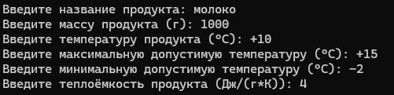
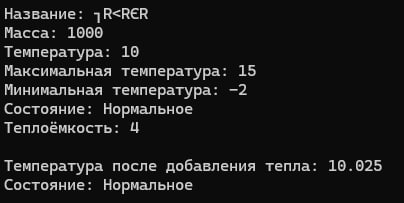
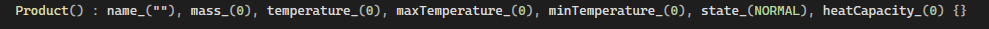
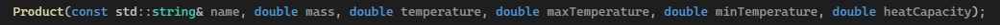
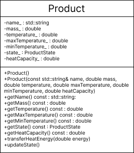

# Проект на тему "Пищевой продукт"
### Задачей является разработка программы, которая позволит пользователю создавать объекты класса Product, моделирующие пищевые продукты для информационной системы службы доставки. Класс Product должен учитывать температурный режим хранения продукта и его изменение при передаче тепловой энергии.

## Дополнительные условия, учитываемые при разработке программы:

1. Проверка корректности входных данных:
   
3. Название продукта: Не должно быть пустым, должно состоять только из букв и пробелов.
4. Масса продукта: Должна быть положительным числом.
5. Температура продукта: Должна быть числом.
6. Максимальная и минимальная температура: должны быть числами, при этом максимальная температура должна быть больше минимальной.
7. Теплоёмкость продукта: Должна быть числом.
8. Переход продукта в новое состояние: При достижении продуктом максимально допустимой температуры, он переходит в состояние “Перегрет”. Аналогично в случае достижения минимальной температуры, продукт переходит в состояние “Переморожен”.
9. Передача тепловой энергии: Метод transferHeatEnergy должен вычислять новую температуру продукта с учетом переданного тепла и обновлять состояние продукта.
10. Простой интерфейс для пользователя: Программа должна иметь простой и понятный интерфейс для ввода данных о продуктах и просмотра информации о них.
11. Работа с пользователем: Программа должна позволять пользователю вводить данные о нескольких продуктах.
11.Вывод информации о продукте: Программа должна выводить следующую информацию о продукте:
Название
Масса
Текущая температура
Максимальная допустимая температура
Минимальная допустимая температура
Состояние (Нормальное, Перегрет, Переморожен)
Теплоёмкость

## Тестовые данные и ожидаемые результаты
|исходные данные|ожидаемый результат|
|---------------|--------------------|
|||
||код выдаст ошибку по скольку введена отрицательная масса|
||код выдаст ошибку по скольку температура продукта не может содержать в себе другие знаки помимио + и -|
||код выдаст ошибку по скольку минимальная темепература не может быть больше максимальной|
||код выдаст ошибку по скольку теплоемкость должна быть числом|

## Проектирование свойств класса

1. **name_ (имя продукта)**

Тип данных: std::string - позволяет хранить произвольную текстовую строку, что подходит для наименования продукта.

*Ограничения:*

- Не должно быть пустым;

- Не должно содержать только цифры (чтобы избежать путаницы с идентификатором);

- Должно состоять только из букв и пробелов (для простоты).

2. **mass_ (масса продукта)**

Тип данных: double - позволяет хранить вещественные числа, что подходит для представления массы продукта.

*Ограничения:*

- Должно быть положительным числом (масса не может быть отрицательной);

- Должно быть в единицах граммов (из-за единицы измерения heatCapacity_).

3. **temperature_ (температура продукта)**

Тип данных: double - позволяет хранить вещественные числа, что подходит для представления температуры.

*Ограничения:*

- Нет жестких ограничений на диапазон, но стоит учесть реальные значения, характерные для продуктов (например, от -273.15 °C до 1000 °C).

4. **maxTemperature_ (максимальная допустимая температура)**

Тип данных: double - позволяет хранить вещественные числа, что подходит для представления температуры.

*Ограничения:*

- Должно быть больше или равно minTemperature_;

- Должно быть в единицах °C.

5. **minTemperature_ (минимальная допустимая температура)**

Тип данных: double - позволяет хранить вещественные числа, что подходит для представления температуры.

*Ограничения:*

- Должно быть меньше или равно maxTemperature_;

6. **heatCapacity_ (теплоемкость продукта)**

Тип данных: double - позволяет хранить вещественные числа, что подходит для представления теплоемкости.

*Ограничения:*

- Должно быть положительным числом;

- Должно быть в единицах Дж/(г*К) (для согласования с расчетом изменения температуры).

7. **state_ (состояние продукта)**

Тип данных: ProductState - это перечисление (enum), которое позволяет задать ограниченное количество состояний продукта:
NORMAL (нормальное)
OVERHEATED (перегрето)
FROZEN (заморожено)

## Конструкторы и деструкторы

|код|назначение|список параметров|значения параметров по умолчанию|
|---------------|--------------------|---------------|--------------------|
||Создает объект класса Product с начальными значениями для всех полей|не имеет|name_ = "" (пустая строка), mass_ = 0, temperature_ = 0, maxTemperature_ = 0, minTemperature_ = 0, state_ = NORMAL, heatCapacity_ = 0|
||Создает объект класса Product с заданными значениями для всех полей|name: const std::string&, mass: double, temperature: double, maxTemperature: double, minTemperature: double, heatCapacity: double|нет, все параметры обязательны|

Поскольку в этом коде все поля класса - простые типы данных (строки, числа), то для них деструктор не нужен, так как освобождение памяти происходит автоматически, когда объект уничтожается.

## Проектирование методов класса

**Открытые функции (public):**

_Product(): Конструктор по умолчанию_

Список параметров: Нет;

- Тип возвращаемого значения: Нет (конструкторы не возвращают значения);

- Обоснование: Создает объект класса Product с начальными значениями для всех полей по умолчанию;

- Проверка корректности: Не требуется, так как инициализирует поля значениями по умолчанию;

**Product(const std::string& name, double mass, double temperature, double maxTemperature, double minTemperature, double heatCapacity): Конструктор с параметрами**

Список параметров:

- name: const std::string& (константная ссылка на строку) - имя продукта;

- mass: double - масса продукта (в граммах);

- temperature: double - температура продукта (в °C);

- maxTemperature: double - максимальная допустимая температура (в °C);

- minTemperature: double - минимальная допустимая температура (в °C);

- heatCapacity: double - теплоемкость продукта (в Дж/(г*К));

- Тип возвращаемого значения: Нет (конструкторы не возвращают значения);

- Обоснование: Создает объект класса Product с заданными значениями для всех полей;

- Проверка корректности:

- Проверяет, что maxTemperature больше или равно minTemperature.

_getName() const : std::string: Возвращает имя продукта_

- Список параметров: Нет;

- Тип возвращаемого значения: std::string (строка);

- Обоснование: Предоставляет доступ к имени продукта;

- Проверка корректности: производится в функции main;

_getMass() const : double: Возвращает массу продукта_

- Список параметров: Нет;

- Тип возвращаемого значения: double (вещественное число);

- Обоснование: Предоставляет доступ к массе продукта;

- Проверка корректности: производится в функции main чтобы масса была положительным числом;

_getTemperature() const : double: Возвращает температуру продукта_

- Список параметров: Нет;

- Тип возвращаемого значения: double (вещественное число);

- Обоснование: Предоставляет доступ к температуре продукта;

- Проверка корректности: производится в функции main.

_getMaxTemperature() const : double: Возвращает максимальную допустимую температуру_

- Список параметров: Нет;

- Тип возвращаемого значения: double (вещественное число);

- Обоснование: Предоставляет доступ к максимальной допустимой температуре;

- Проверка корректности: производится в функции main;

_getMinTemperature() const : double: Возвращает минимальную допустимую температуру_

- Список параметров: Нет;

- Тип возвращаемого значения: double (вещественное число);

- Обоснование: Предоставляет доступ к минимальной допустимой температуре;

- Проверка корректности: производится в функции main.

_getState() const : ProductState: Возвращает состояние продукта_

- Список параметров: Нет;

- Тип возвращаемого значения: ProductState (перечисление);

- Обоснование: Предоставляет доступ к состоянию продукта;

- Проверка корректности: Не требуется.

_getHeatCapacity() const : double: Возвращает теплоемкость продукта_

- Список параметров: Нет;

- Тип возвращаемого значения: double (вещественное число);

- Обоснование: Предоставляет доступ к теплоемкости продукта;

- Проверка корректности: Не требуется. 

_transferHeatEnergy(double energy): Передает тепловую энергию продукту_

- Список параметров:

- energy: double - количество передаваемой тепловой энергии;

- Тип возвращаемого значения: void (не возвращает значение);

- Обоснование: Изменяет температуру продукта, добавляя к ней тепловую энергию;

- Проверка корректности:
Проверяет, что energy неотрицательное.

__*Закрытые функции (private):*__

_updateState(): Обновляет состояние продукта_

- Список параметров: Нет;

- Тип возвращаемого значения: void (не возвращает значение);

- Обоснование: Закрытая функция, которая обновляет состояние продукта state_ в зависимости от его температуры;

- Проверка корректности: Не требуется, так как она основывается на внутренних полях класса.

 

## Проектирование главной функции main

1. _**Тестирование конструктора с параметрами:**_

- Создается объект product1 с заданными параметрами.
  
- Вывод информации о продукте с помощью геттеров.

2. _**Тестирование метода transferHeatEnergy:**_

- Передача тепловой энергии продукту product1.
  
- Вывод новой температуры и состояния продукта.

3. _**Тестирование конструктора по умолчанию:**_

- Создается объект product2 с помощью конструктора по умолчанию.
  
- Вывод информации о продукте по умолчанию.
  
4. _**Тестирование проверки корректности ввода массы:**_

- Ввод массы с консоли.
  
- Проверка, что введенная масса является положительным числом.
  
- Вывод сообщения о корректности ввода.
  
5. _**Тестирование проверки корректности передачи тепловой энергии:**_

- Попытка передачи отрицательной энергии продукту product1

- Проверка выброса исключения invalid_argument и вывод сообщения об ошибке.
  
6. _**Тестирование проверки корректности создания продукта:**_

- Попытка создания продукта product3 с некорректными значениями (максимальная температура меньше минимальной).

- Проверка выброса исключения invalid_argument и вывод сообщения об ошибке.

## Вывод

Разработанный класс Product  демонстрирует  применение объектно-ориентированного программирования для моделирования реальных объектов с учетом их характеристик и поведения.
Он позволяет эффективно моделировать поведение продукта, учитывая его тепловые свойства. Класс включает в себя необходимую информацию о продукте (имя, масса, температура, допустимые температуры, состояние, теплоемкость), а также методы для изменения температуры и обновления состояния продукта.

Тестирование класса Product показало, что он корректно работает, обрабатывает исключения и обеспечивает необходимую функциональность. 
